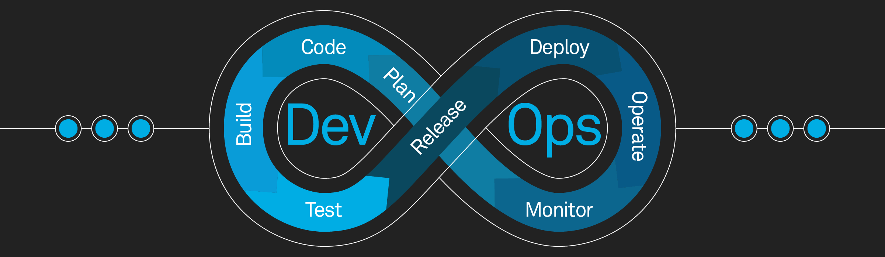

👋 Hi, I’m mahdi imanpour @Network-Wizard

Welcome to my digital domain where technology meets magic. This repository is where I explore and document the latest in 💻Networking, 📟Security, 🧑‍💻DevOps, ☁️Cloud, 🤖AI, and 🔥Cutting Edge IT Trends.
👀 I’m interested in:

Sure, here's a more concise version of your README sections:

    🧑‍💻 DevOps: Streamline development with the newest DevOps tools and practices. Access cutting-edge trends, guides, and sample workflows.

    ☁️ Cloud: Harness innovative cloud technologies to upgrade IT infrastructures. Get the latest trends, detailed documentation, and hands-on examples.

    💻 Networking: Dive into the latest in networking—from architectures to protocols. Explore new topics with concise documentation and practical samples.

    📟 Security: Tackle advanced cyber threats with up-to-date defensive strategies. Find fresh insights and examples in our security section.

    🐧 Linux: Some cool Linux stuff. Service implementation, hints, configs ,/etc !!
    
    🤖 AI: Push forward with AI innovations that think and learn. Explore new developments through in-depth documentation and practical samples.

    🔥 Trends: Stay on top of emerging tech trends. Our resources include analyses, documentation, and samples to help you grasp and apply new technologies(SDN,XaaS,MEC,IOE,...).

🌱 I’m currently learning:

    Cutting-edge DevOps practices and CI/CD pipelines to streamline software development and deployment.
    Advanced cloud networking & security techniques to safeguard infrastructure in an ever-evolving threat landscape.
    Exploring the latest trends in AI, with a focus on large language models (LLMs) and their potential to transform industries.

🎯 I’m looking to collaborate on:

    Innovative DevOps and CI/CD projects that enhance automation and streamline development processes.
    Building and optimizing scalable, secure cloud infrastructure and services.
    AI-driven initiatives, especially those leveraging the latest advancements in large language models (LLMs) and ethical AI practices.
    Exploring and implementing cutting-edge IT technologies to push the boundaries of modern software development.
    Contributing to trending academic research that drives the future of technology and informs best practices in the industry.

📫 About me:

A passionate explorer at the intersection of DevOps, cloud computing, and network security, with over 4 years of hands-on experience navigating these dynamic fields. As a PhD candidate in Computer Science, my curiosity knows no bounds—constantly driven to unravel the latest technological advancements and innovate solutions that push the envelope.

📮 How to reach me:

    LinkedIn: https://www.linkedin.com/in/mahdi-imanpour-819242156
    Email: mahdi.emanpour@gmail.com

⚡ Fun fact:

    Remember to get your ☕️coffee ready and put some 🎸rock music on ...
